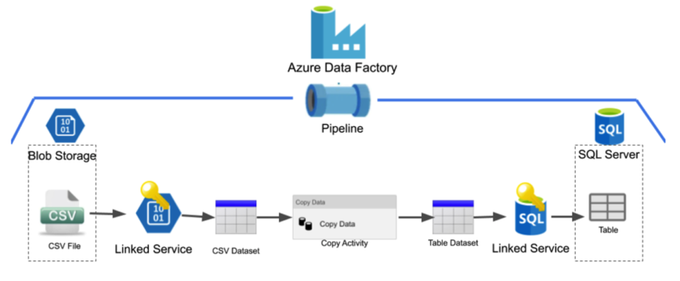
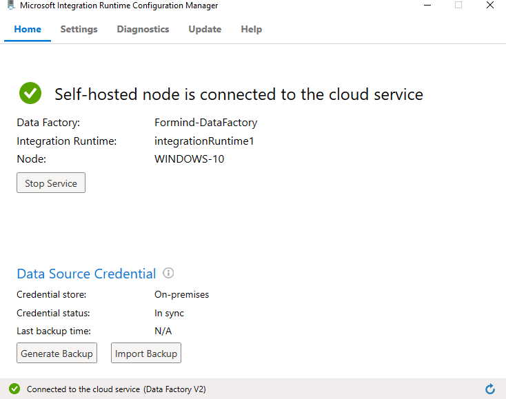
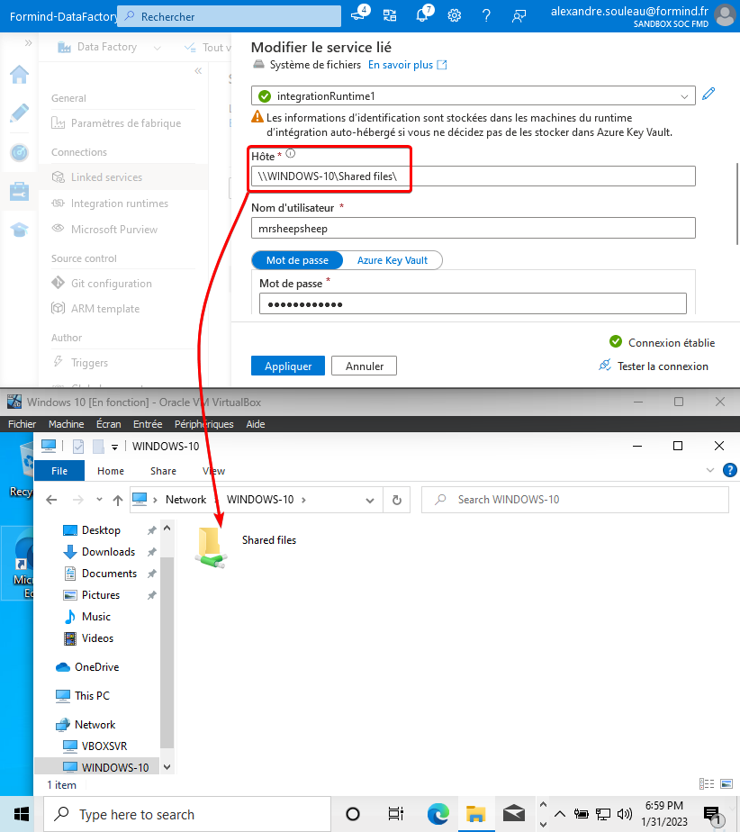
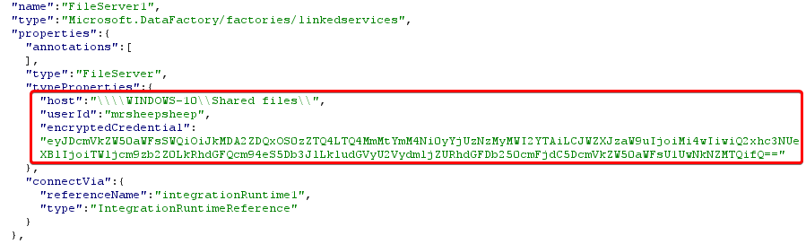
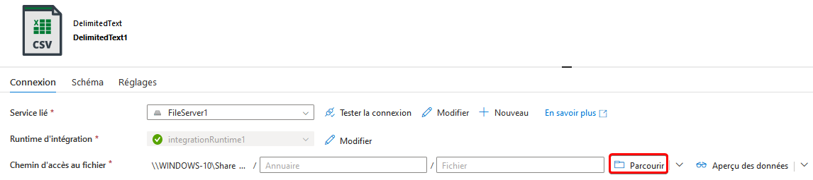
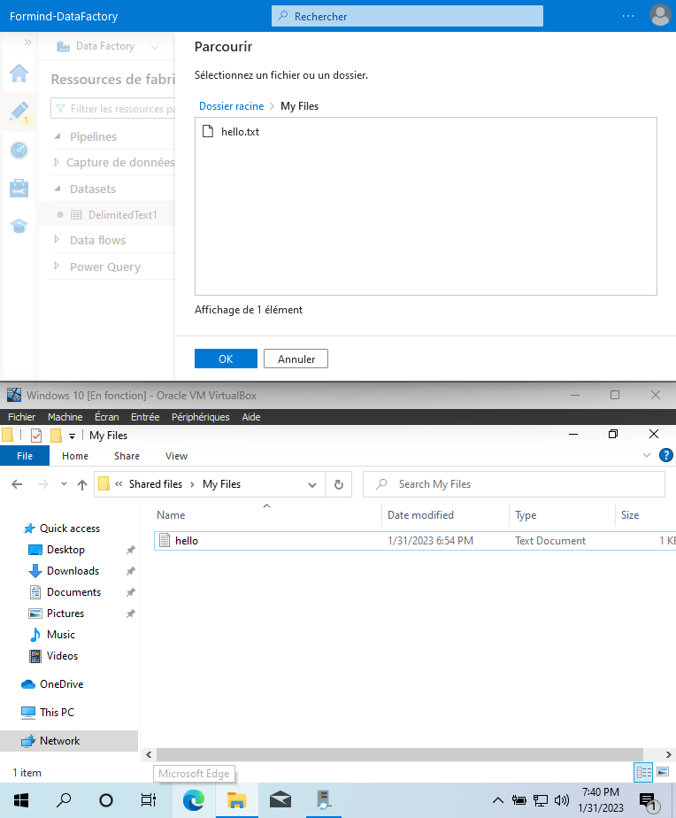
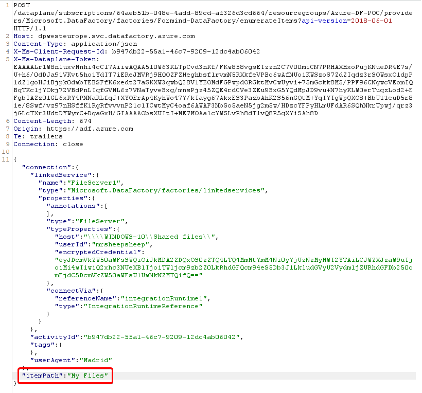
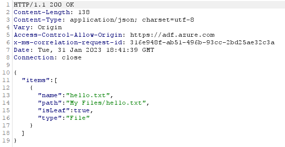

In 2022, my team at Formind conducted a security assessment for a business using Azure Data Factory. The scope was a resource group related to data pipelines run daily by the company and updated by multiple collaborators.

Apart from regular security misconfigurations in the RBAC permissions for the resources inside the group, we found out that we were able to fully compromise the internal network of the company straight from Azure Data Factory, using undocumented features and taking advantage of the lack of security guidelines from Microsoft.

> **Disclaimer**
> _We have no experience in using Data Factory as an Azure product. We are only focusing on the security issues we discovered during our mission. If we misunderstood something, please let us know, we would be happy to learn more !_

Azure Data Factory File Server credentials are supposed to be linked with a single Host and File location. Trying to change these parameters for a Man in the Middle scenario is not allowed by the UI. However, it is possible to bypass this restriction by exploiting LFI/RFI-capable parameters in Data Factory API endpoints, allowing users with access to the File Server resource to read local and remote file and directory contents using the specified credentials. File access is relative to the network of the Integration Runtime server, on-premise. This can lead to the compromission of On-Premise Active Directory assets straight from Azure if multiple misconfiguration are chained together :

* Weak firewall rules
* Privileged account used for File Server access
* Incorrect SMB ACLs
* Cleartext credentials inside GPO scripts

### Overview of Azure Data Factory and the File Server connector

The data modeling and pipelines were built around Azure Data Factory, which provides a dedicated IDE for building data pipelines using all kind of data connectors. An interesting feature of Azure Data Factory is the ability to run data transformations and data transfers on self-hosted instances, which Microsoft calls « Bring Your Own Cluster ».

To host your own cluster, a *Microsoft Integration Runtime* (IR) agent must be installed on a server or workstation. The IR can then be selected from Azure to be used as a compute node for data modeling.

In Data Factory, whenever you need to read or write data somewhere, a data connector of any kind must be created. One of the most basic data connector for IR instances is the *File Server* connector. This connector can be set up to open a file storage location, either locally or remotely, using SMB.

In most cases, access to the desired storage location must be authenticated using local Windows credentials or AD credentials in the case of a remote SMB location. Credentials are stored either in an Azure Keyvault or locally on the IR. Here, we create a File Server location, which is the local IR instance we created before. However, to demonstrate the remote capabilities, we’re using a SMB location and not an absolute file path. We’re creating a File Server service to reach the « Shared files » folder :

If stored in the IR, the credentials are encrypted using local DPAPI secrets. Azure stores a reference to these credentials, **coupled with the Host and SMB location**. If, for any reason, someone tries to modify the File Server configuration to specify another SMB location on the UI, the password field will be reset, indicating that it must be provided in order to save the connection.

You can see a reference to the credentials in the used to test the connection to the File Server here in many HTTP requests and responses from Azure API endpoints :

### Enumerating files and re-using the credentials outside of their scope

Let’s create a new Dataset pulling CSV data from the new File Server we just added.

We can enumerate the files and folders inside the « Shared files » SMB share usig the « Browse » button. Here, this is the « My Files » directory contents.

Let’s take a look at what the HTTP to enumerate directory contents look like :

And the response :

When setting up the credentials on the File Server, it seemed obvious that the credentials and file server location are tied together. But unexpectedly, they are not! In this case, we should be tied to the « Shared files » SMB share. Trying to tamper the « host » property to change the destination leads to an error:

But what happens if we try to specify an arbitrary `itemPath` attribute ?

We get the full directory listing of the C drive ! This is the local filesystem of the IR node. Enumerating contents of any directory is possible as long as the user we configured previously (here, the local administrator account) has privileges to do so. It is also possible to do that on a remote server, for example a Domain Controller « NETLOGON » share.

### Reading files

Now that we can enumerate directory contents, let’s try to read some files. Using the same CSV resource we created before, we can try to read the file contents using the « preview data » button. Let’s read the `hello.txt` file and look at the HTTP request. In our case, the browser sends a `POST` request to `/dataplane/subscriptions/64aeb51b-048e-4add-89cd-af326d3cd664/resourcegroups/Azure-DF-POC/providers/Microsoft.DataFactory/factories/Formind-DataFactory/executeTabularData?commandBehavior=Preview\&previewCount=10\&api-version=2018-06-01`

Inside the JSON data, a `location` structure specifies the `fileName` and `folderPath` of the file we want to preview.

Inside the `GET` parameters, we can specify the (unlimited ?) number of rows we want to read in the file. Let’s change the file location to something outside of the File Server. Changing the `columnDelimiter`, `escapeChar` and `quoteChar` to empty values also help reading contents :thumbsup:

And there we go, reading arbitrary files! Using a remote SMB path just works as well:

### Writing files

Yes, we can also write arbitrary files. This is a bit trickier, however. We need to create a new pipeline with the « Copy data » activity.

> Source : create a new binary from any available linked service. HTTP is the easiest in our opinion.

> Destination : create a new binary to the existing File Service, set an arbitrary or empty path.

The contents of the source will be copied into the destination, if you have the rights to do so. We identified two different behaviors when trying to write files :

1. When writing a file locally, the `DIAHostService` acccount writes the file
2. When writing a file over SMB (even when reaching the local host), the `DIAHostService` impersonates the account configured on the File Service.

### Attack vectors and ideas

#### Leaking sensitive data from remote SMB shares

Such as a DC’s `SYSVOL` containing startup scripts, useful for collecting technical information, or even passwords!

#### Leaking the NTLM hash of the File Server account

Since this is a SSRF, we can also use that to obtain NTLM credentials of the configured account if the firewall allows it :

#### Network reconnaissance

We didn’t find a way to weaponize this bug to scan networks. The File Server resource only supports SMB on port 445 and local files. There is no difference in response content or delay when trying to reach an unreachable IP.

### Disclosure

MSRPC has been contacted regarding this issue and has determined too many misconfigurations were required to exploit this. Yet, they agreed the documentation as of 12/2023 lacks security guidelines to prevent these misconfigurations. We have MSRPC approval to disclose this issue.

#### Timeline

* 09/12/2022 – Successfully compromised the client’s environment from Azure via Data Factory
* 13/12/2022 – Issue reported to MSRC as VULN-082001
* 21/12/2022 – MSRC determined the issue is By Design and too many misconfigurations are required for any security impact
* 31/01/2022 – Sent draft for disclosure post

### Credit

* Luc ROMAIN
* Alexandre SOULEAU (MrSheepSheep)

### Suggested Remediations

Basically, these are the two misconfigurations that must be fixed and that Microsoft cannot take responsibility of :

* Privileges of the File Server account on the different SMB shares and local filesystem, including remote shares. Make sure this account is dedicated to Azure Data Factory usage and/or Integration Runtime features and has no access besides the intended shares. Make this account local if possible to prevent re-using this account inside an Active Directory environment.
* Network segregation and firewall rules. Prevent unwanted SMB traffic from the IR node. Runtime Integration nodes should be considered exposed to the internet since they can be remotely accessed by Azure.

From our point of view, Microsoft should also fix the issue on their side. The IR node should check whether the File Server `host` attribute matches the requested file path, and not trust data coming from Azure.
