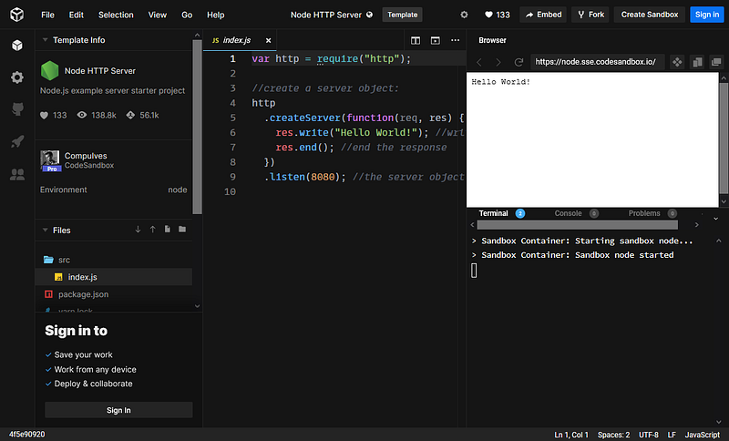
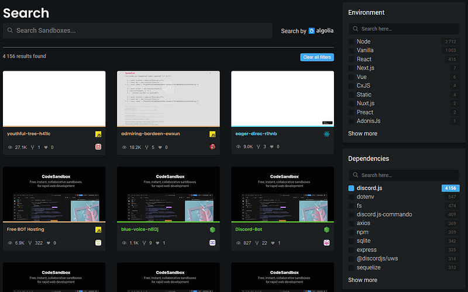
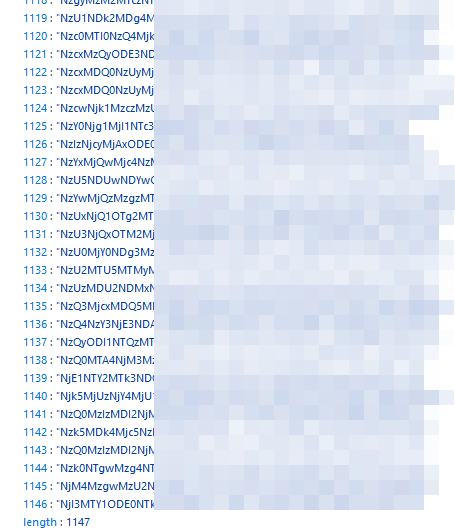
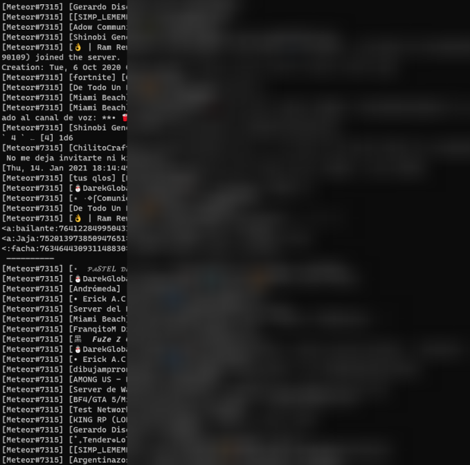
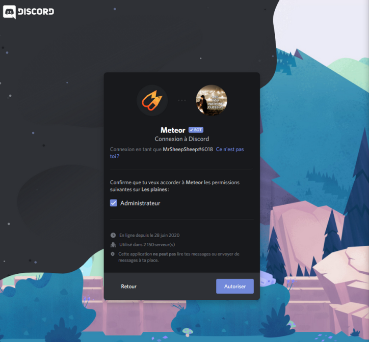
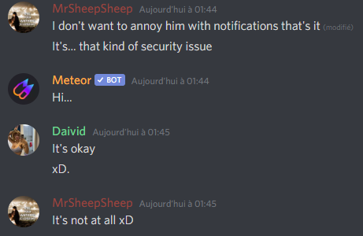
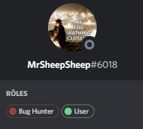
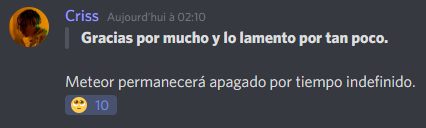
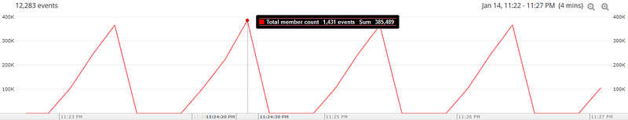
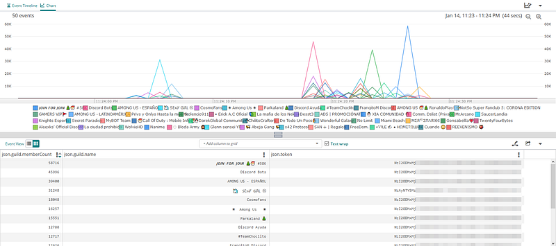

The number one security rule you should follow when developing on publicly available platforms is to never expose application secrets.

The most widely known website where sensitive data exposure happens is Github. You can experience this by yourself pretty easily, actually. This kind of leakage happens quite regularly : [it’s potentially one of the reasons the SolarWinds hack occured](https://twitter.com/vinodsparrow/status/1338431183588188160/photo/1) a few weeks ago !

But I’m not here to talk about Github scraping. Today, I found another juicy target : [https://codesandbox.io/](https://codesandbox.io/)

Codesandbox (at the time of writing) provides web-based IDEs (“sandboxes”) for developing all kind of applications (mostly websites). It supports many different languages and has all the features you would need for developing an app from prototype to deployment. It’s great, and the free plan offers everything you need except unlimited private sandboxes.

As I’m writing this, codesandbox.io is hosting nearly 11 million projects publicly. You can search for sandboxes by name, tag, environment, or dependencies the projet may require.

#### Discord on a sandbox ?

I’m often developing Discord bots for fun, and I was curious about running or testing bots on codesandbox. It appears many projects have tried (and succeeded).

Obviously, not all projects are completed. Many of them are just drafts that do nothing interesting.

At this point, you probably know what’s going to happen.

#### Leaking discord bot tokens

In order to run a Discord bot, you need to login using a provided secret token. It is unique and should be kept secret, as anyone with this token could impersonate the bot. The token is 59 characters, divided into three parts. This is a valid regex for finding a Discord token :`/[MN][A-Za-z\d]{23}\.[\w-]{6}\.[\w-]{27}/g`

I’m not going to scrap those tokens manually by opening the 4156 sandboxes by hand and looking for tokens. Using Codesandbox’s search page queries, I was able to fetch all sandboxes names via Javascript, in the browser. Then, for each of these sandboxes, I could request all sandbox’s files and content and look for a discord token using the above regex pattern. The annoying part in scraping Codesandbox is that it is protected by Cloudflare and requests to sandbox data are rate-limited.

I’m not going to show any code as I think it’s pretty self-explanatory, and it would be too easy for script kiddies to copy the code 😉.

Once I scraped all sandboxes, I ended up with 1147 discord tokens. That’s a 1/4 chance of getting a token by simply opening any sandbox using discord.js

I repeat, 25% sandboxes are exposing discord tokens publicly on this website. This is huge !!!

#### Beep boop ?

Now is the time to test whether the tokens are still valid or not.

Since I obtained those tokens by looking for the discord.js library, I’m going to use it to run a bot for each of these tokens, and see if it works.

**End result : I was able to login as 566 different bots out of 1146.**

I never thought I would be able to run that much bots at once, ever.

So I guess it didn’t take long for me to… check what was going on with these bots. I decided to print all messages received by the bots. Anyone said _“privacy”_ ?

Messages were fuzzing, and funny enough, some Minecraft server logs were showing up, but something really stood out of the ordinary ; a single bot, **Meteor#7315**, was **spamming** my terminal. And messages didn’t came from just one server, there were **hundreds** of them !!! I was receiving between 4000 and 8000 messages every minute.

#### Hitting a meteor … 🌠

Okay, so let’s forget about the small bots for a minute. Based on the number of messages I’m receiving, Meteor is a public bot. A quick Google search lead me to [one of the bot’s page on discord.bots.gg](https://discord.bots.gg/bots/726831270616629354). Chances are, most Discord server admins would have reached this page to add the bot to their server.

So let’s try to invite the bot !

So… the bot is asking for Administrator permissions. That’s the worst thing that could happen. The bot wants to be able to read and send messages on all channels (potentially to other bots, too), ban members, edit roles, change the server owner, create channels, webhooks…

And Meteor doesn’t run on a dozen servers. **It runs on 2150 servers**, which means I’m in now able to delete, own, or even spy on all of them without anyone noticing.

Better contact the developer right now !

#### … and watching it explode ! 💥

I wooshed in the bot’s official Discord server to warn about the issue and sent a private message to the developer. I also talked about the issue on the general channels.

I found out they had a “Bug Hunter” role so I also decided to assign it to myself while waiting.

Quickly after that, the developer hit the “Regenerate token” button on Discord developer portal. I was finally disconnected.

But apparently, the developer had some issues with the new token. He was not able to retrieve the new one, and the bot is now shut down until Discord support team fixes the issue.

#### End words

This was my first experience with scraping leaked information on publicly available sources. Discord bot tokens were a fun target to play with, but keep in mind that this method also works with any kind of credentials that may be stored there : AWS secrets, Firebase and Google service accounts, SMTP, SSH keys, MySQL credentials…

For the remaining bots that I leaked the tokens of, I invalidated all of them by publishing [a gist containing the all the tokens](https://gist.github.com/mrsheepsheep/cbfe00db234ccc812153fc71d05b2569) I found along with their sandbox name.

> The gist has been deleted for unknown reasons and without notification. I sent a ticket to Github support regarding this.

This night, 600 Discord bots died between my hands (hopefully for a short period of time).

Statistics I obtained from this discovery showed that this leak could have affected a minimum of **385 000** users.

