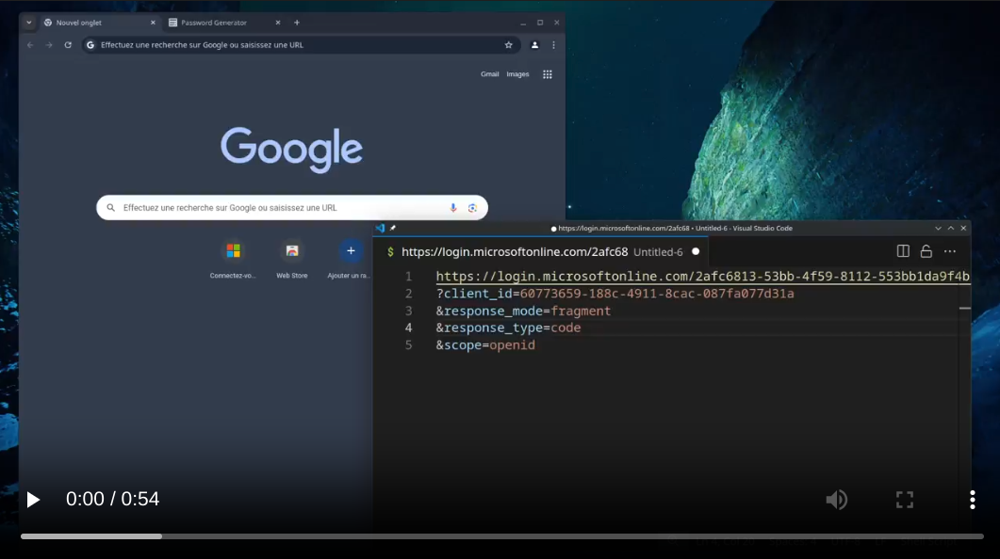

Many Cloud identity providers offer the ability to delegate authentication to an external identity providers. This is known as Federated authentication.

This post focuses on providers that offer Federated passthrough authentication to on-premise directories such as Active Directory or LDAP.

If implemented incorrectly on the provider's side, on-premise passthrough authentication can be abused by threat actors to perform phishing attacks from the provider's login page directly, under the attacker's tenant / organization page.

I'm not sure this topic has been fully covered before. I'm essentially extending [XPN's incredible work](https://blog.xpnsec.com/identity-providers-redteamers/) which covers post-exploitation abuse and a bit of "blackbox" phishing. This is all based on my own research on the topic.

This phishing scenario is much more powerful than traditional attacker-hosted phishing pages, as it allows the attacker to leverage the provider's branding, trust, and root domain to trick the victim into entering their credentials. Identity providers are often whitelisted by internal proxies, and password managers may even prefill passwords on attacker's tenants.

Identity providers do not consider this a vulnerability, as it is a feature of the product. However, I believe it is a security risk that should be addressed, until passwordless authentication becomes the norm for everyone.

## Identity Providers

During my research, I encountered 3 different identity providers behaviors that could be exploited.

The following table lists the identity providers that are known to be exploitable (or not) using each techniques, described below.

| Provider          | Passthrough | Known-login | Prefill | |
|----------         |-------------|-------------|---------|-|
| Google Workspace  | ❌          | ❌          | ❌      |
| Entra ID          | ❌          | ❌          | ✅      | 
| Okta              | ✅          | ✅          | ❌      | Also known as [Oktajacking](https://pushsecurity.com/blog/oktajacking/).
| Auth0             | ✅          | ✅          | ✅      | It's a feature.
| PingIdentity      | ✅          | ✅          | ?       | See [XPN's PoC](https://blog.xpnsec.com/identity-providers-redteamers/)

Some service providers (not identity-specific) may also be exploited, depending on how they integrate on-premise authentication with their own federation systems.

## Phishing Vectors

### Passthrough phishing

When the victim enters their credentials, the identity provider will forward the cleartext password to the on-premise agent.

If the identity provider checks the existence of the username against the attacker's directory, the attacker can deploy a catch-all proxy to always fullfill the request.


Passthrough phishing can be deployed to target a large number of users.

### Known-login phishing

When passthrough is not possible and just-in-time provisioning is not available, the attacker can still perform a known-login attack. This method is less effective as it requires the attacker to know the username of the targeted victim. It's usually used in a spear-phishing scenario.

The attacker expects the victim to enter an username that's already in the attacker's directory. The identity provider will first check the existence of the username, and if it exists, forward the cleartext password to the on-premise agent.

If the identity provider does not check existence of the username against the attacker's directory, the method is a actually a passthrough phishing. By nature, all passthrough phishing are also known-login phishing.

This method usually requires to spoof the victim's username, especially in the case of email addresses. 

The known-login phishing method can also be combined with the prefill method to increase the success rate.

In some cases, the Known-login method *may* be considered a vulnerability that can be fixed by the provider.

### Prefill phishing (a.k.a. login hint phishing)

To prevent known-login ohishing, some identity providers require tenant / organization owners to prove ownership of the domain before they can use it.

However, it is still possible to perform a prefill attack, which allows an attacker to prefill the username field with a username that's already in the attacker's directory.


Some providers allow the attacker to prefill the username field. The attacker can prefill the username field with a username that's already in the attacker's directory.

The attacker can either typosquat the victim's domain or use built-in domains provided by the identity provider.


The victim will then enter their password, and the identity provider will forward the cleartext password to the on-premise agent.

## The right way to do it

Identity Providers have multiple choices to properly do federated authentication with on-premise directories.: 
1. Enforce email authentication and domain ownership verification. Disable username prefill.
2. Synchronize password hashes *from* the on-premise directory *to* the cloud directory. This ensures no password will ever be sent in cleartext to the on-premise agent / third-party system. [Google has implemented this solution for AD authentication](https://cloud.google.com/architecture/identity/federating-gcp-with-active-directory-synchronizing-user-accounts).


3. *Redirect* the user to the third-party authentication system, like ADFS / SAML. At least, the identity provider will not be responsible for forwarding credentials, and the scenario becomes a generic phishing scenario.

Some identity providers, like Entra ID, provide both passthrough authentication and password hash synchronization. Alas, as long as passthrough authentication exists on the identity provider, it will be possible to perform a prefill attack.

### User awareness

Because branding can easily be spoofed thanks to provider's customization options. The root domain may be considered trusted by most users.
Users are trained to double-check URLs for typosquatting, but they will most likely trust any typosquatted subdomain of a trusted root domain.

Thus, there must be other, non-spoofable ways of telling the user where they're logging in.

Sadly, it's exceptionnally hard to display non-spoofable yet user-friendly, human-rememberable information.

Providers could display a warning on the login page when passthrough authentication is enabled.

## Some example providers

### Entra ID

**Update : [see Keanu Nys research at DEFCON 33](https://media.defcon.org/DEF%20CON%2033/DEF%20CON%2033%20presentations/Keanu%20Nys%20-%20Turning%20Microsoft%27s%20Login%20Page%20into%20our%20Phishing%20Infrastructure.pdf)**

Entra ID is vulnerable to a Prefill attacks using the `login_hint` and `username` [OIDC URL query parameters](https://learn.microsoft.com/fr-fr/entra/identity-platform/v2-protocols-oidc).

An attacker could setup its own Entra ID tenant and prepare credential harvesting using [CloudInject](https://github.com/xpn/CloudInject).

The attacker must create dedicated AD accounts for its victims, and prefill their username according to one of the [user's valid UPNs](https://learn.microsoft.com/en-us/entra/identity/hybrid/connect/plan-connect-userprincipalname).

```
GET https://login.microsoftonline.com/{tenant}/oauth2/v2.0/authorize?
client_id=00001111-aaaa-2222-bbbb-3333cccc4444
&response_type=code%20id_token
&redirect_uri=http%3A%2F%2Flocalhost%2Fmyapp%2F
&response_mode=form_post
&scope=null
&username=victim@attacker-tenant.onmicrosoft.com
&login_hint=victim@attacker-tenant.onmicrosoft.com
```

Previously, Entra ID was vulnerable to UPN spoofing, allowing attackers to spoof arbitrary logins, as shown in the demo video :

[](demos/entra.mp4)
<video src="demos/entra.mp4" controls="1"></video>

**Generic example**

[You can try the prefill trick directly here on the "common" tenant](https://login.microsoftonline.com/common/oauth2/v2.0/authorize?client_id=00001111-aaaa-2222-bbbb-3333cccc4444&response_type=code%20id_token&redirect_uri=http%3A%2F%2Flocalhost%2Fmyapp%2F&response_mode=form_post&scope=null&username=victim@attacker-tenant.onmicrosoft.com&login_hint=victim@attacker-tenant.onmicrosoft.com).

`attacker-tenant.onmicrosoft.com` can be abused to typosquat another's tenant root domain.

> The `login_hint` parameter can also be set on Microsoft apps such as a victim's legitimate sharepoint and others apps. The parameter will be transferred to the login page as-is. The prompt will be displayed even if the victim is already logged-in into its own tenant.

Outlook redirection example : http://outlook.live.com/?login_hint=victim@attacker-tenant.onmicrosoft.com

Sharepoint redirection example : https://microsoft.sharepoint.com/?login_hint=victim@attacker-tenant.onmicrosoft.com

**Tenant typosquatting**

Say `MyCompany` uses `mycompany.net` as its primary UPN domain and `mycompany-org.onmicrosoft.com` as its Entra ID domain. The victim's legitimate primary UPN is `victim@mycompany.net`.

The attacker could then register a new Entra domain `mycompany.onmicrosoft.com` and prefill `victim@mycompany.onmicrosoft.com`.

Full domain typosquatting is also possible but requires the attacker to prove domain ownership to Azure.

### Okta

[OktaJacking](https://pushsecurity.com/blog/oktajacking/) can be exploited in a Known-Login scenario.

However, it is possible to use the Okta LDAP agent and a catch-all user proxy to enhance PushSecurity's attack and remove the known-login requirement, making it a full Passthrough phishing.

[](demos/okta.mp4)

### Auth0

Auth0 can be turned into a phishing hosting platform by design.

### PingIdentity

[Refer to XPN's work in Identity Providers for Redteamers](https://blog.xpnsec.com/identity-providers-redteamers#Phishing).

## Detection 

If you're a detection engineer or working in a SOC, you have very few options with a high false positive rate.

You will most likely have to ignore the vector and focus on post-authentication detection.

Eventually, think about it during incident response and threat hunting. Check for unknown provider tenant requests (either subdomains or tenant IDs)

## Resources and previous work

- https://blog.xpnsec.com/okta-for-redteamers/
- https://blog.xpnsec.com/identity-providers-redteamers/
- https://blog.xpnsec.com/azuread-connect-for-redteam/
- https://pushsecurity.com/blog/oktajacking/
- https://web.archive.org/web/20220823115131/https://www.imperva.com/blog/how-i-impersonated-someone-else-using-auth0/
- https://auth0.com/blog/phishing-attacks-with-auth0-facts-first/

Please let me know about other research material I may have missed !