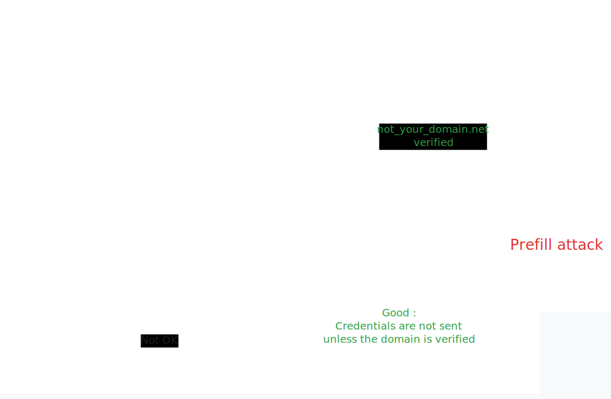

+++
title = 'Cloud Identity Providers Phishing'
date = '2025-05-03T00:00:00+01:00'
+++

# Cloud IdP Credential Phishing

When identity providers do the phishing for us

# Obligatory Disclaimer

You're responsible for your actions.

Only for educational purposes and authorized / simulated environments.

# Azure

Once upon a time... in 2019

## Azure Pass-Through-Authentication

Adam Chester @xpnsec

https://blog.xpnsec.com/azuread-connect-for-redteam

https://www.youtube.com/embed/UxKEQ9tIiLs

Dr Nestori Syynimaa (@DrAzureAD)

https://aadinternals.com/post/pta/

---

# PTASpy

1. Post-exploit an compromised Azure ADConnect agent
2. Hook `LogonUserW` by DLL injection
3. Intercept and store credentials sent to MSA

# *What if we don't need to compromise the agent ?*

Can we trick a victim to log into our own tenant ?

---

<video src="demos/entra.mp4" width="900" controls="1"></video>

# What sorcery is this ?

MS Docs

No magic - just OIDC

## Login hint phishing

Victim logs into a prefilled form and thinks they are logging into their own account.

Only 1 rule : user UPN must exist in Entra

---

<pre>
https://login.microsoftonline.com/
<b class="yellow">common</b>
/oauth2/v2.0/authorize
?client_id=60773659-188c-4911-8cac-087fa077d31a
&response_type=code%20id_token
&scope=null
&response_mode=fragment
<b class="red">&login_hint=victim@myorg.onmicrosoft.com</b>
<b class="red">&username=victim@myorg.onmicrosoft.com</b>
</pre>

<b class="yellow">Common Azure tenant</b>
<b class="red">Fake prefilled email</b>

# Let's phish

Target:

kyle.b@<b class="yellow">southparkelementary.net</b>

## Real tenant

### Dumb tenant

### Dumb mail ?!

### Tenant evil twin

*kyle.b@<b class="yellow">southparkelementary</b>.onmicrosoft.com*

### Tenant typosquatting

### Verified domain typosquatting

### OIDC parameters follow redirects...

southparkelementary.sharepoint.com/<b class="red">?login_hint=XXX</b>

Redirects to login.microsoftonline.com/<b class="yellow"><tenant></b>/oauth2/authorize?.....<b class="red">&login_hint=XXX</b>

### Bonus : $10k UPN spoofing (now fixed)

# General methodology

1. Choose a passthrough identity provider / service
2. Send forged URL to victim
3. Intercept authentication
4. Profit

## 3 ways to phish

Depending on the provider

1. Passthrough
2. Known-login
3. Prefill

### Passthrough phishing

Any credential is sent to the attacker

### Passthrough phishing

### Known-login phishing

Victim login must exist in attacker's user directory

Example: Entra ID demo

### Domain verification

Prevents known-login phishing

### Prefill phishing

## Phishing harder

- Brand spoofing (logos, colours...)
- Abuse redirection features
  - Legit service + OIDC parameters = prefill attack
  - Chain with MFA bypass / phishing
- Automation

# Examples

| Provider          | Passthrough | Known-login | Prefill | |
|----------         |-------------|-------------|---------|-|
| Google Workspace  | ❌          | ❌          | ❌      |
| Entra ID          | ❌          | ❌          | ✅      | 
| Okta              | ✅          | ✅          | ❌      | Also known as [Oktajacking](https://pushsecurity.com/blog/oktajacking/).
| Auth0             | ✅          | ✅          | ✅      | It's a feature.
| PingIdentity      | ✅          | ✅          | ?       | See [XPN's PoC](https://blog.xpnsec.com/identity-providers-redteamers/)

## Okta

[org].okta.com
trial-[random].okta.com

---

<b class="yellow">Can you guess the phishing vector ?</b>

### Okta passthrough

Turn a known-login vector into a passthrough vector using a **catchall LDAP proxy**

### Okta

Login Hint (OIDC)

<b class="red">Passthrough username / email</b>

Organization typosquatting

Catch-all 🔥🔥🔥

---

<video src="demos/okta.mp4" controls="1" width="1000"></video>

## Auth0 (Okta)

Does not verify domains

100% custom branding

External OTP

100% custom auth flow

<b class="red">Phishing as a Service 🔥🔥🔥</b>

---

---

---

---

## Google Workspace

*Unidirectional directory sync*

Passwords are pushed from directory to Google's

Verified domains only

<b class="green">Not exploitable</b>*

<small>*until proven otherwise ;)</small>

# Versus traditional phishing

- No fronting infrastructure / evilnginx / bitb...
- In most cases, **free**
- **Trusted providers / domains / certificates**
    - High chances of bypassing proxy whitelists
- Extremely hard to detect
    - No alerts
    - By users / victims
    - By SOC friends <small>(sorry...)</small>

# Tools

- Entra ID : https://github.com/xpn/CloudInject
  - Can be improved to handle incorrect passwords
- Okta
  - Known-login : CloudInject
  - Passthrough : LDAP catch-all proxy (not public yet)

# Fix ?

Providers won't fix it.

---

Okta don't care.

# Countermeasures & hunting

Depends on the IdP :(

Does not protect you against uncovered IdPs.

# Hunt

- Entra ID
  - Proxy logs including `login_hint` with unknown / weird emails
- Okta
  - `(.*)\.okta.com`, look for unknown subdomains...
- Post-mortem...

# Thank you

@mrsheepsheep

[github.com/mrsheepsheep/idp-passthrough-phishing](https://github.com/mrsheepsheep/idp-passthrough-phishing)

For more technical details : at the bar ;)